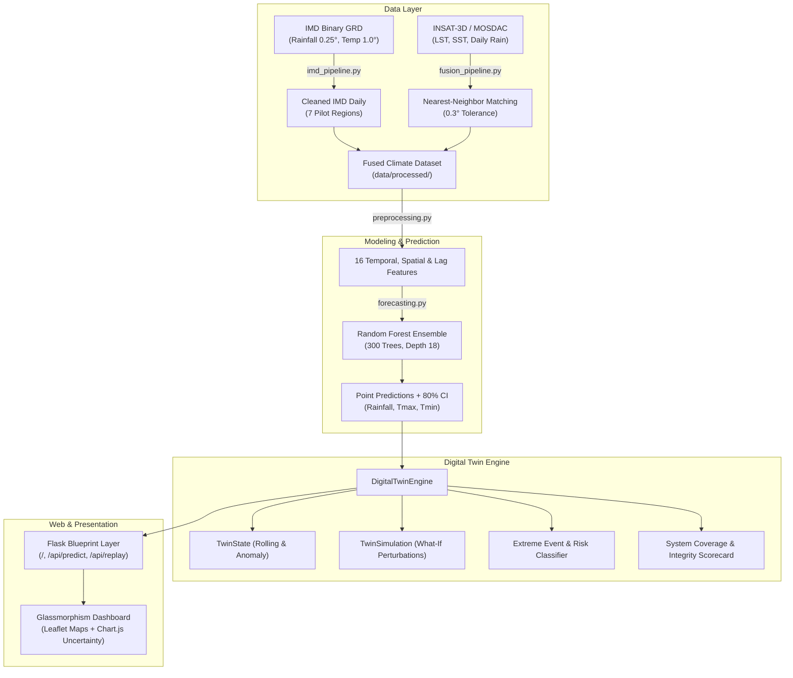

# Sky Mirror India — AI-Powered Climate Digital Twin

An AI-powered, uncertainty-aware spatio-temporal Digital Twin of India's climate. Fuses India Meteorological Department (IMD) gridded observations (0.25° rainfall, 1.0° temperatures) and INSAT satellite layers (Land Surface Temperature, Sea Surface Temperature) into an interactive operating dashboard with what-if climate stress simulation.

---

## Key Capabilities

* **Spatiotemporal Climate Forecaster**: Multi-output ensemble model (300-tree Random Forest) predicting Daily Rainfall, Max Temperature ($T_{max}$), and Min Temperature ($T_{min}$) with 80% empirical prediction intervals ($P_{10} - P_{90}$).
* **Uncertainty Quantification**: Quantifies forecast spread from tree-level ensemble variance and outputs calibrated prediction bands.
* **What-If Scenario Lab**: Interactive climate perturbations (Rainfall $\pm 60\%$, Temperature $\pm 6.0^\circ\text{C}$, 3–30 day horizons) computing cumulative precipitation budgets, water surplus/deficit, and rule-based adaptive advisories.
* **Extreme Event Intelligence**: Automated detection of heavy precipitation ($>64.5\text{ mm}$), thermal heatwaves ($>37^\circ\text{C}$ / $>40^\circ\text{C}$), dry spells, and 99th-percentile hazard breaches against 15-year climatological baselines.
* **Historical Backtest Replay**: Retroactive validation tool comparing model predictions against ground truth observations across custom historical time windows.
* **Scientific Honesty & Transparency**: Rigorous basis tracking tagging every value as `Observed`, `ML Forecast`, `Rule Estimated`, `Rule Derived`, `Climatological Probability`, or `Ensemble Variance`.

---

## System Architecture



---

## Pilot Regions

| Region | Coordinates | Climate Regime |
|---|---|---|
| **Kerala Coast** | 9.5°N, 76.5°E | Tropical monsoon, heavy maritime precipitation |
| **Indo-Gangetic Plain** | 26.5°N, 81.0°E | Subtropical alluvial, severe winter/summer extremes |
| **Northeast** | 26.0°N, 91.7°E | High precipitation, orographic rainfall |
| **Central India** | 22.0°N, 79.0°E | Continental monsoon core, fused with INSAT |
| **Deccan Plateau** | 17.8°N, 78.5°E | Semi-arid rain-shadow plateau |
| **Rajasthan Desert** | 27.0°N, 73.0°E | Arid zone, extreme diurnal thermal range |
| **Coastal Odisha** | 20.5°N, 85.5°E | Bay of Bengal coastal & cyclonic influence |

---

## Quickstart

### 1. Environment Setup

```bash
python3 -m venv .venv
source .venv/bin/activate
pip install -r requirements.txt
```

### 2. Train & Validate Forecaster

```bash
python scripts/train_model.py
python scripts/validate_model.py
```

### 3. Launch Digital Twin Dashboard

```bash
python app.py
```

Visit [http://127.0.0.1:5010](http://127.0.0.1:5010) in your browser.

---

## API Endpoints

* `GET /` — Interactive single-page digital twin cockpit.
* `POST /api/predict` — Dynamic what-if prediction with payload:
  ```json
  {
    "region": "Kerala Coast",
    "rainfall_delta_pct": 25.0,
    "temp_delta_c": 1.5,
    "horizon_days": 14
  }
  ```
* `POST /api/replay` — Historical backtest engine:
  ```json
  {
    "region": "Central India",
    "start_date": "2024-06-01",
    "end_date": "2024-07-15"
  }
  ```
* `GET /health` — Service health check.

---

## Running Test Suite

```bash
PYTHONPATH=. .venv/bin/python -m pytest -v
```
